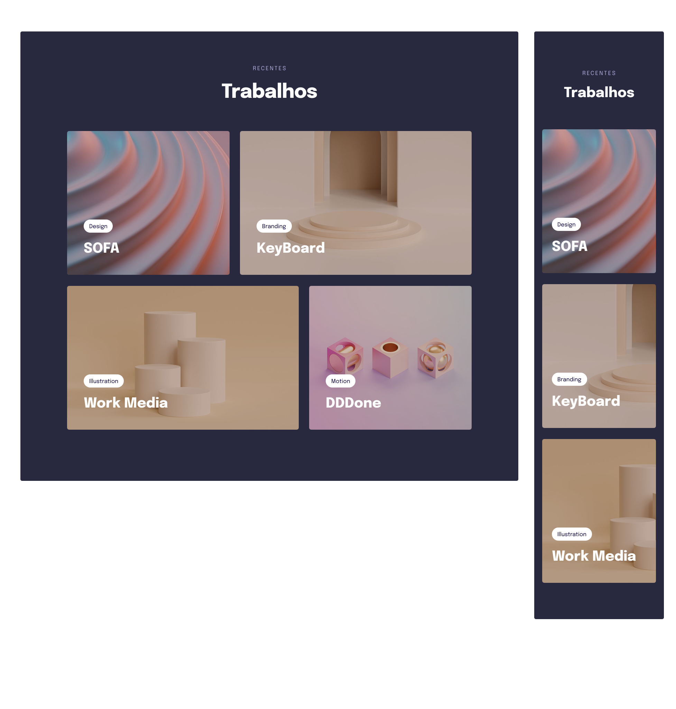

<div align="center">
  
  <h2 align="center">Responsividade</h2>

</div>

<br />


### Demo Screeshots



### About

Project developed during stage 3 - Moving forward in HTML and CSS, in [Rocketseat](https://github.com/Rocketseat) explorer course.  

I learned in Phase 3 of the stage about the use of CSS variables and how they can be useful for storing reusable values and colors, making code maintenance easier and more efficient. I also discovered how to work with colors in the HSL format, which offers a flexible and intuitive approach to manipulating hues, saturation, and luminosity.

Another important concept was positioning elements using properties like position, which allows controlling the placement of elements on the page, and object-fit, which defines how an image should fit inside an element. I also learned about the use of display: inline-flex, which combines the benefits of display: inline and display: flex, allowing for the creation of flexible and responsive layouts.

To add interactivity and animations to designs, I explored the transform and transition properties, which enable creating smooth transformation and transition effects on elements, adding motion and dynamism to web pages. I also learned about CSS animations, which offer a powerful way to create complex and captivating animation sequences.

Another interesting concept was the use of display: grid, which allows creating complex and responsive grid layouts efficiently. I learned to use the filter property to apply visual effects like blur, saturation, and brightness to elements, offering creative options for styling elements in unique ways.

Finally, I learned about the clamp() function, which allows creating CSS values that automatically adjust within a specific range, useful for creating responsive layouts that adapt to the dimensions of the parent element, screen, or other factors.

These CSS concepts have provided me with a wide range of tools to create modern, responsive, and interactive web designs, making my web development skills more versatile and powerful.

### Prerequisites

Before you begin, ensure you have met the following requirements:

- [Git](https://git-scm.com/downloads "Download Git") must be installed on your operating system.

### Run Locally

To run **Responsividade** locally, run this command on your git bash:

Linux and macOS:

```bash
sudo git clone https://github.com/denilsonbaptista/components-jobs.git
```

Windows:

```bash
git clone https://github.com/denilsonbaptista/components-jobs.git
```

### Contact

If you want to contact with me you can reach me at [Linkedin](https://www.linkedin.com/in/denilsonbaptista/).

### License

This project is **free to use** and does not contains any license.